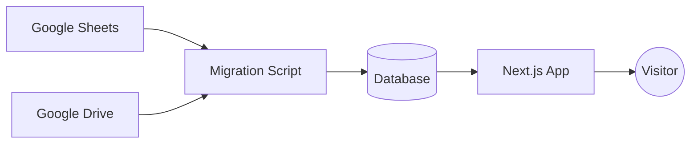

# System Design: snfforms.com

## Overview

The snfforms.com platform is designed to provide a real-time, user-friendly
catalog of forms. The design leverages Google Sheets as a lightweight Content
Management System (CMS) and Google Drive for asset storage, allowing business
owners to manage their product catalog without technical expertise.

## Core Components

### 1. Data Source: Google Sheets

The primary source of truth for the catalog is a Google Sheet. This allows for
real-time updates to the product list.

#### Catalog Sheet Schema

| Column        | Description                             | Type     |
| :------------ | :-------------------------------------- | :------- |
| `formId`      | Unique identifier for the form          | String   |
| `category`    | Product category (e.g., Medical, Legal) | String   |
| `description` | Detailed product description            | String   |
| `size`        | Physical dimensions of the form         | String   |
| `paper`       | Paper type/weight                       | String   |
| `color`       | Color options                           | String   |
| `sides`       | Number of sides (e.g., Single, Double)  | String   |
| `unit`        | Measurement unit                        | String   |
| `file0`       | Primary image filename/ID               | File Ref |
| `file1`       | Secondary image filename/ID             | File Ref |
| `pdf0`        | PDF version filename/ID                 | File Ref |

### 2. Asset Storage: Google Drive

A dedicated Google Drive folder contains all visual and document assets
(`file0`, `file1`, `pdf0`). Assets are linked in the Google Sheet by their
filename or unique Drive ID.

### 3. Application: Next.js Frontend

The frontend is built with Next.js, focusing on performance and SEO.

- **Data Fetching**: The application fetches data from the seeded database (or
  directly from the Sheet/Drive API for real-time previews).
- **Dynamic Routing**: Product pages are generated dynamically based on the
  `formId`.
- **Image Optimization**: Utilizes `next/image` to serve optimized versions of
  assets stored in Google Drive.

### 4. Contact Form

The platform includes a contact form for user inquiries regarding specific forms
or general questions.

#### Contact Form Fields

- **Full Name**: Required field.
- **Email Address**: Validated email field.
- **Subject**: Dropdown or text field (e.g., Request Quote, General Inquiry).
- **Message**: Textarea for detailed inquiry.

#### Submission Handling

1. **Frontend Validation**: Ensure all required fields are filled and the email
   format is correct.
2. **API Route**: A Next.js API route (`/api/contact`) handles the POST request.
3. **Storage**: Submissions are appended to a separate "Inquiries" sheet in the
   primary Google Sheet for centralized management.

### 5. Data Migration & Seeding

To ensure high performance and reliability, data is synchronized from Google
Sheets/Drive to a local or cloud-hosted database.

- **Migration Script**: A Node.js/TypeScript script that:
  1. Reads the Google Sheet using the Google Sheets API.
  2. Maps the sheet rows to the Application Data Model.
  3. Downloads/Mirrors assets from the Google Drive folder.
  4. Seeds the primary database with the structured data.
- **Trigger**: The script can be run manually or via a webhook/scheduled job
  whenever the catalog needs a refresh.

## Data Flow

## Security & Access

- **API Access**: Server-side service accounts are used to read from private
  Google Drive resources and Google Sheets.
- **Resource Protection**: Direct access to the Drive folder is restricted;
  assets are served through an authorized proxy or temporary signed URLs if
  necessary.
